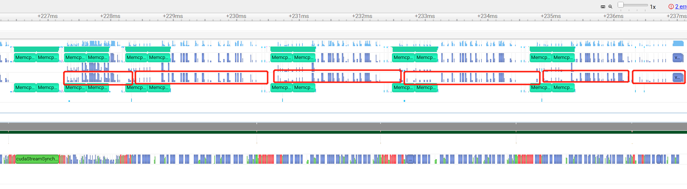

# Done

- Fix bugs: kernel and communications are not overlapped.
- Implement Encoder Fetch on demand for very large model experiments. (Recommended by Jianyu)
- Basic profiling

| Frameworks-models-scale (remarks)                  | (Normalized) Performance (tokens/s) |
| -------------------------------------------------- | ----------------------------------- |
| HF-T5-base                                         | 1x                                  |
| FT-T5-base                                         | 4.3x                                |
| FT-T5-base-8(without prefetch and offloading)      | 1.8x                                |
| FT-T5-base-8(with decoder prefetch and offloading) | 0.8x=>1.1x                          |

### Nights visualization

**Notice the model is very small, this result may not reflect the large model situation accurately.**

Decoder pattern

Encoder pattern

## Known problems

- The expert activation pattern is abnormal when using random weights. 
  - Encoder: 256 rows activate just one expert
  - Decoder: 4 rows activate just one expert
- layer-one fetching takes 1/10 times.
